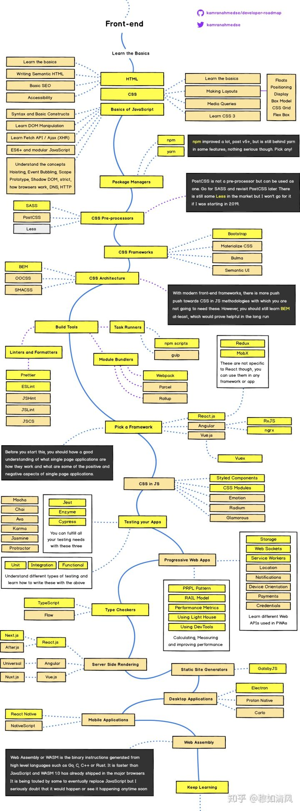

# frontend-roadmap

## phase 1 Job Ready

* Create a Pomodoro Application.

* Create a webpage that uses GitHub Repositories API to fetch and show the top 10 repositories of the current week in a nice responsive format.

* Create a simple todo list application that allows you to add tasks, mark them complete, edit them and delete them.

* Create a simple stop watch where user can start, stop, pause and reset.